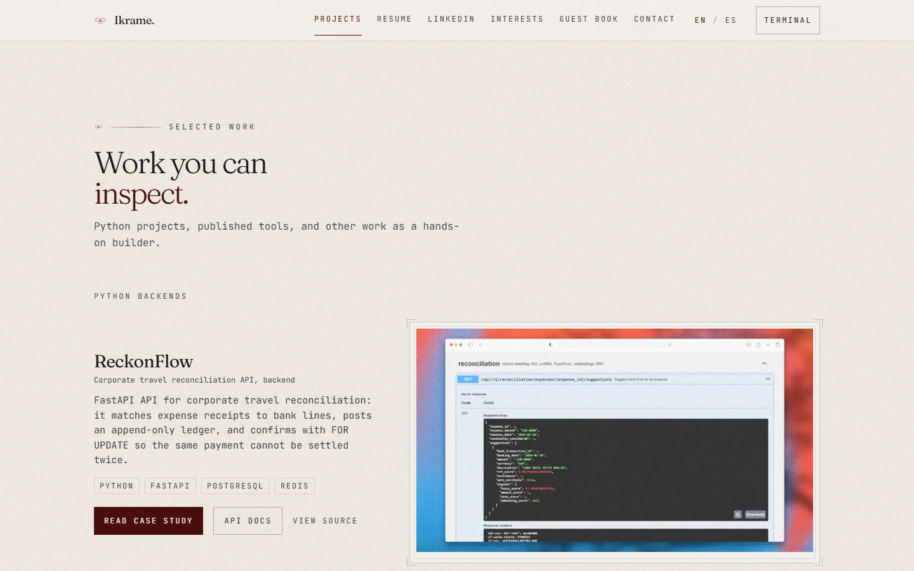
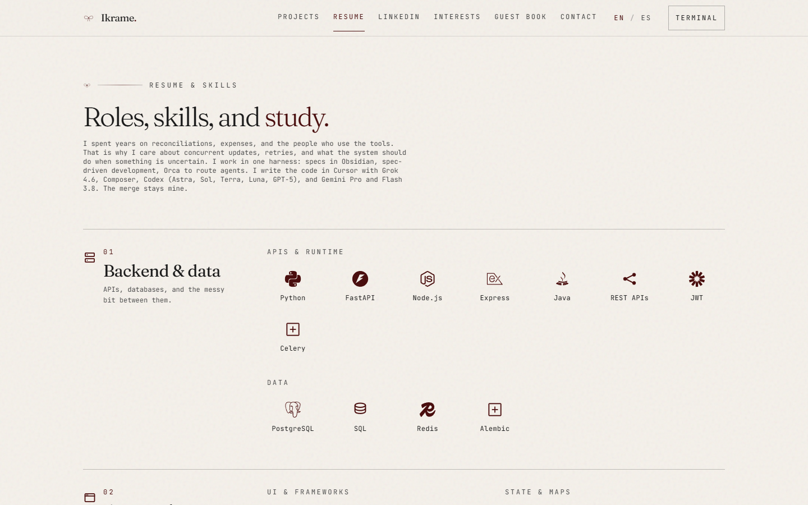

# dev-portfolio

[](https://ikrame.dev/)

**Personal portfolio site** — English and Spanish, cream paper aesthetic, guest book, contact form, and a CLI easter egg in the corner.

Portfolio project (v0.1.0): React SPA deployed on Vercel. Guest book syncs via Upstash; contact form uses Resend.


| | |
| --- | --- |
| **Live site** | [ikrame.dev](https://ikrame.dev/) |
| **Source** | [github.com/ikrame-ih/dev-portfolio](https://github.com/ikrame-ih/dev-portfolio) |

## Highlights

- **English and Spanish** — language toggle in the nav; same layout, local copy
- **Hero** — role, positioning, and downloads for the CV and cover letter (EN/ES PDFs)
- **Projects** — three lanes: Python backends (ReckonFlow, Validata), published tools (PyPI CLI and skills.sh localization skill), and other work
- **Experience** — timeline, education, and languages on the page
- **LinkedIn notes** — selected posts and recommendations
- **Guest book** — shared bows via Upstash Redis on Vercel; localStorage fallback on localhost
- **Contact** — Resend-powered form with rate limiting
- **Analytics** — optional GoatCounter (privacy-friendly, no cookies); set `VITE_GOATCOUNTER_CODE`
- **CLI terminal** — hidden command palette for navigation and easter eggs
- **Design system** — cream paper palette, Framer Motion reveals, Mermaid diagrams

## Preview







## Quick start

**Prerequisites:** Node.js 20+, npm.

```bash
git clone https://github.com/ikrame-ih/dev-portfolio.git
cd dev-portfolio/web
npm install
cp .env.example .env   # optional — contact & guest book locally
npm run dev
```

Open [http://localhost:5173](http://localhost:5173). Guest book API routes only exist on Vercel (or `vercel dev`).

## Scripts

| Command | Purpose |
| --- | --- |
| `npm run dev` | Dev server (port 5173) |
| `npm run build` | Production build |
| `npm run preview` | Preview production build |
| `npm run capture:readme` | Regenerate README screenshots (Playwright) |
| `npm run cv:pdf` | Render CV HTML to PDF |
| `npm run cover-letter:pdf` | Render cover letters to PDF |

**Vercel deploy:** set root directory to **`web/`**.

## Stack

React 19 · Vite 6 · Tailwind CSS 3 · Framer Motion · Lucide · Mermaid · Upstash Redis · Resend

## Environment

Copy `web/.env.example` → `web/.env` for local API routes (or configure in Vercel).

| Variable | Purpose |
| --- | --- |
| `UPSTASH_REDIS_REST_URL` | Guest book persistence |
| `UPSTASH_REDIS_REST_TOKEN` | Guest book auth |
| `RESEND_API_KEY` | Contact form delivery |
| `CONTACT_TO_EMAIL` | Inbox for contact submissions |

Never commit `.env` files or API keys.

## Project layout

```
web/
├── src/
│   ├── components/     # UI sections (Hero, Projects, CV, LinkedIn, CLI…)
│   ├── data/           # locales, assets, stack icons
│   ├── i18n/           # language switch and UI strings
│   └── lib/            # guest book API, theme, storage
├── api/                # Vercel serverless (bows, contact)
├── public/             # CV and cover-letter PDFs, images, print HTML
└── scripts/            # README shots, CV and cover-letter PDF render
docs/                   # Design notes (not deployed)
```

`references/` and `app/` are local-only (gitignored).

## Documentation

Internal build notes live in [`docs/`](docs/) — design system, component map, workflow.

Print artefacts live under `web/public/cv/` and `web/public/cover-letter/` (HTML + CSS). The PDFs are generated with Playwright.

## Regenerate screenshots

```bash
cd web
npm run build && npm run preview -- --port 4173
npx playwright@1.49.1 install chromium   # optional — script falls back to Edge/Chrome
npm run capture:readme
```

To capture the live site (guest book with real bows):

```bash
cd web
$env:CAPTURE_BASE_URL="https://ikrame.dev/?lang=en"
npm run capture:readme
```

## License

Private project — © Ikrame Ibn Hayoun. All rights reserved.

## Author

**Ikrame Ibn Hayoun** — [Portfolio](https://ikrame.dev/) · [GitHub](https://github.com/ikrame-ih) · [LinkedIn](https://www.linkedin.com/in/ikrame-ih/)
