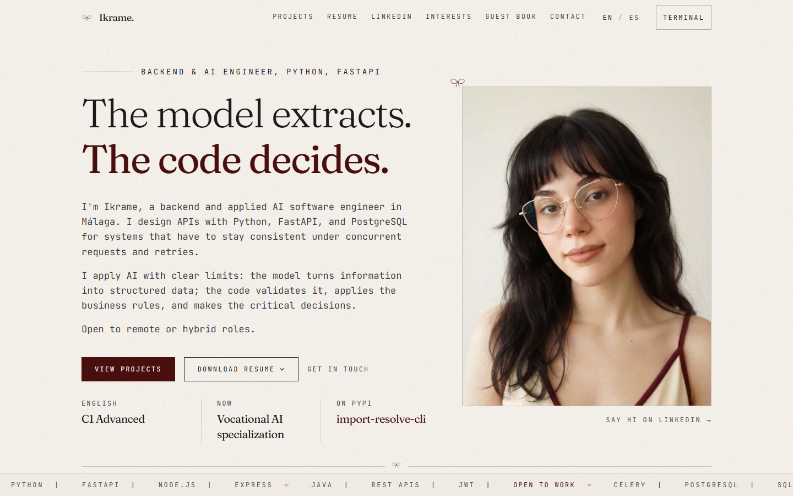
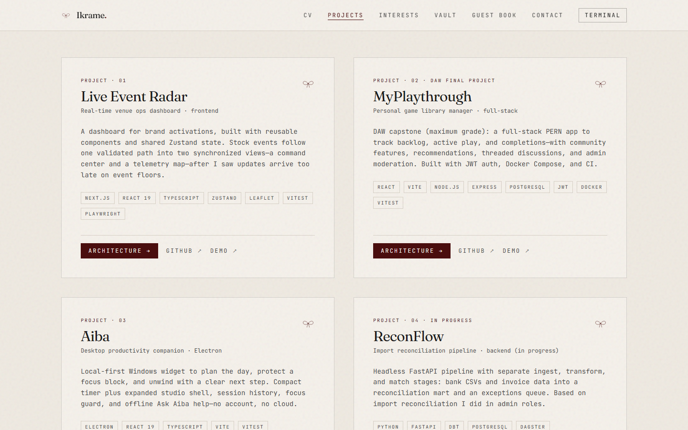
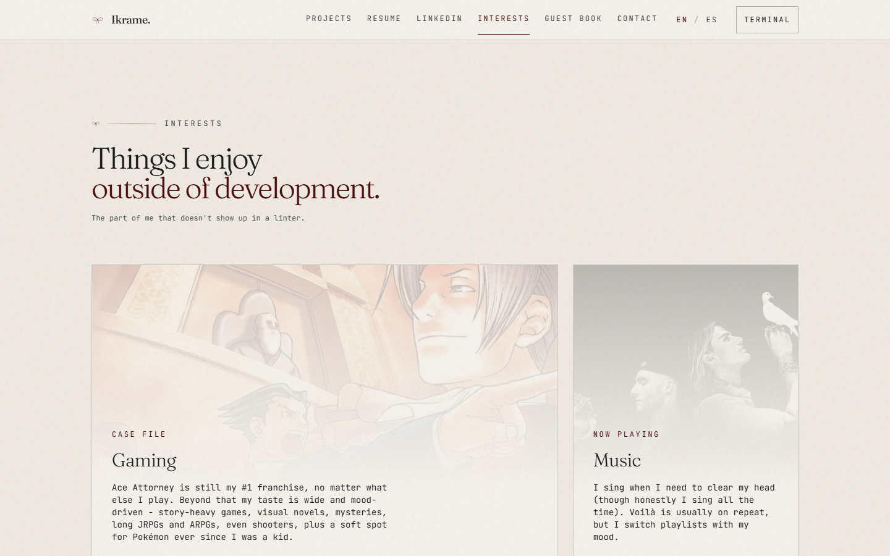
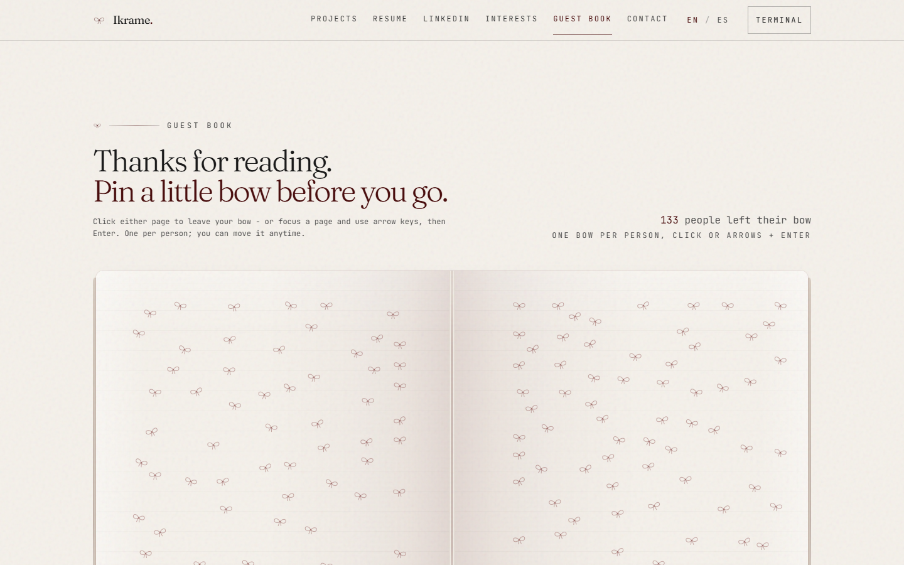

# dev-portfolio

My portfolio site — React + Vite + Tailwind. Cream paper look, CV and projects up front, guest book and CLI on the upper corner.

[](https://ikrame-ih.vercel.app/)
[](https://github.com/ikrame-ih/dev-portfolio)

Stack: React 19, Vite 6, Tailwind, Framer Motion. Guest book syncs via Upstash on Vercel. Contact form uses Resend.

---

## Preview









---

## Run locally

```bash
cd web
npm install
cp .env.example .env   # optional for contact/guest book locally
npm run dev
```

[http://localhost:5173](http://localhost:5173)

```bash
npm run build
npm run preview
```

---

## Vercel env vars

Root directory: **`web/`**

You'll need Upstash (`UPSTASH_REDIS_REST_URL`, `UPSTASH_REDIS_REST_TOKEN`) for the shared guest book, and Resend (`RESEND_API_KEY`, `CONTACT_TO_EMAIL`) for contact. See `web/.env.example`.

Guest book uses localStorage on localhost — the API routes only exist on Vercel (or `vercel dev`).

---

## Quick reference

- Copy: `web/src/data/portfolio.js`
- Images: `web/public/images/` (paths in `assets.js`)
- Guest book API: `web/api/bows.js`
- Contact API: `web/api/contact.js`
- Build notes: `docs/` (not deployed)

`references/` and `app/` are local only (gitignored).

---

## Screenshots

```bash
cd web
npm run build && npm run preview -- --port 4173
npx playwright@1.49.1 install chromium
npm run capture:readme
```

---

Private project — all rights reserved.
