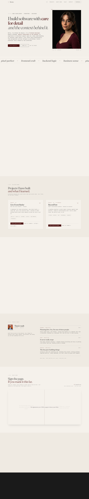

# dev-portfolio

Personal portfolio for **Ikrame I. H.** — editorial single-page site built with React, Vite, and Tailwind. Cream paper aesthetic, CV & projects up front, interests, writing vault, interactive guest book, and a hidden CLI.

[](https://dev-portfolio.vercel.app)
[](https://github.com/ikrame-ih/dev-portfolio)
[](https://react.dev/)
[](https://vitejs.dev/)
[](https://tailwindcss.com/)
[](https://www.framer.com/motion/)

> **After your first Vercel deploy:** replace the Live badge URL with your real domain (e.g. `https://dev-portfolio.vercel.app` or your custom domain).

---

## Preview

### Hero

Staged intro on load — overline, headline, positioning, portrait.


### CV & projects

Background, stack pills, selected work cards with architecture diagrams.


### Interests & vault

Bento grid with hobby imagery and **Tizza's vault** (blog placeholders).


### Guest book

Shared signature spread — click anywhere on either page to leave a bow.


<details>
<summary>Full page</summary>



</details>

---

## Features

| Section | Highlights |
| ------- | ---------- |
| **Hero** | Staged Framer Motion intro (~2s), portrait, scrolling marquee |
| **CV** | Experience, education, languages, stack pills with icons |
| **Projects** | Cards + Mermaid architecture modals |
| **Interests** | Editorial bento grid |
| **Vault** | Personal writing section (placeholders → future Obsidian sync) |
| **Guest book** | Click-to-sign bow spread, shared via Upstash Redis in production |
| **CLI** | Hidden terminal (`Terminal` nav · `` Ctrl+` ``) |
| **Contact** | Form UI (email delivery on roadmap) |

---

## Quick start

```bash
cd web
npm install
npm run dev
```

Open [http://localhost:5173](http://localhost:5173)

```bash
npm run build    # production build → dist/
npm run preview  # serve dist locally
```

---

## Deploy on Vercel

1. Import [github.com/ikrame-ih/dev-portfolio](https://github.com/ikrame-ih/dev-portfolio)
2. Set **Root Directory** to `web`
3. **Build command:** `npm run build`
4. **Output directory:** `dist`
5. Add environment variables for the shared guest book:

| Variable | Purpose |
| -------- | ------- |
| `UPSTASH_REDIS_REST_URL` | Upstash Redis REST URL |
| `UPSTASH_REDIS_REST_TOKEN` | Upstash Redis token |

Copy `.env.example` → `.env.local` for local API testing.

[](https://vercel.com/new/clone?repository-url=https%3A%2F%2Fgithub.com%2Fikrame-ih%2Fdev-portfolio&project-name=dev-portfolio&root-directory=web)

---

## Content

| What | Where |
| ---- | ----- |
| Copy | `src/data/portfolio.js` |
| Images | `public/images/` · registry in `src/data/assets.js` |
| Resume (JSON) | `public/resume.json` |
| Guest book API | `api/bows.js` |

---

## Repo layout

This app lives inside a local Obsidian workspace. Only `web/` is deployed.

| Path | Deployed? |
| ---- | --------- |
| `web/` | Yes |
| `docs/`, `references/`, `app/` | No — gitignored, stay local |

---

## Regenerate screenshots

```bash
npm run build && npm run preview -- --port 4173
npx playwright@1.49.1 install chromium
node scripts/capture-readme-shots.mjs
```

---

## License

Private portfolio project — all rights reserved unless stated otherwise.
